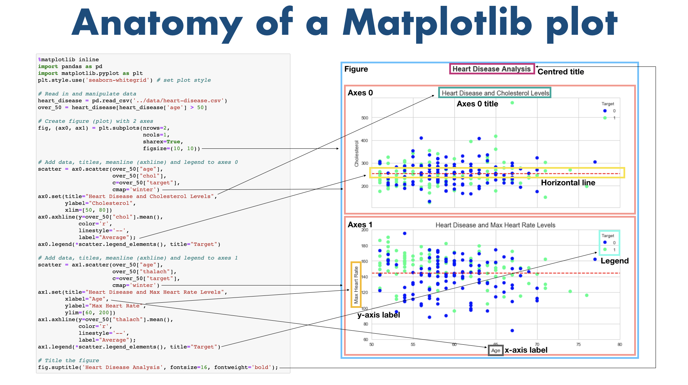

# Matplotlib
complete general overview of matplotlib  
About
- Python plotting library
- Turns our data to pretty visualisations a.k.a `plots` and `figures`!  
Why Matplotlib?
- Built on `numPy` arrays and `python`.
- Intergrates directly with `pandas`.
- Can create basic/advanced plots.
- `Simple` to use Interface!
  
initialise with `%matplotlib inline`. 
the `%matplotlib inline` will make your plot outputs appear and be stored within the notebook. 
2 types
- Pyplot api (less flexible)
- Object Oriented api (recommended) 
Anatomy of a MAtplotlib Figure!!  
 
 
